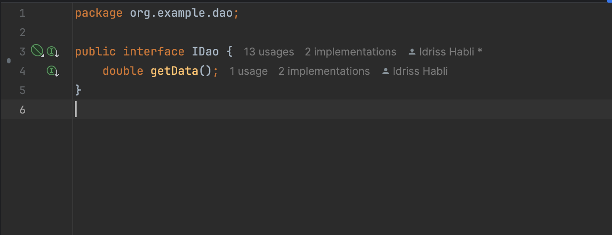
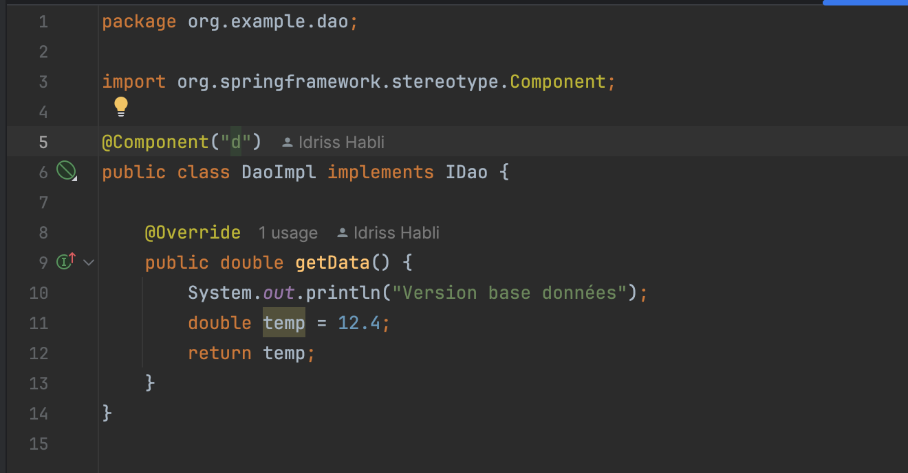
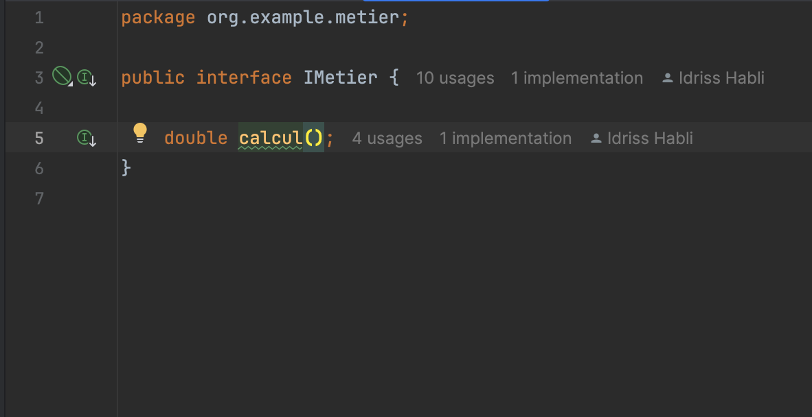
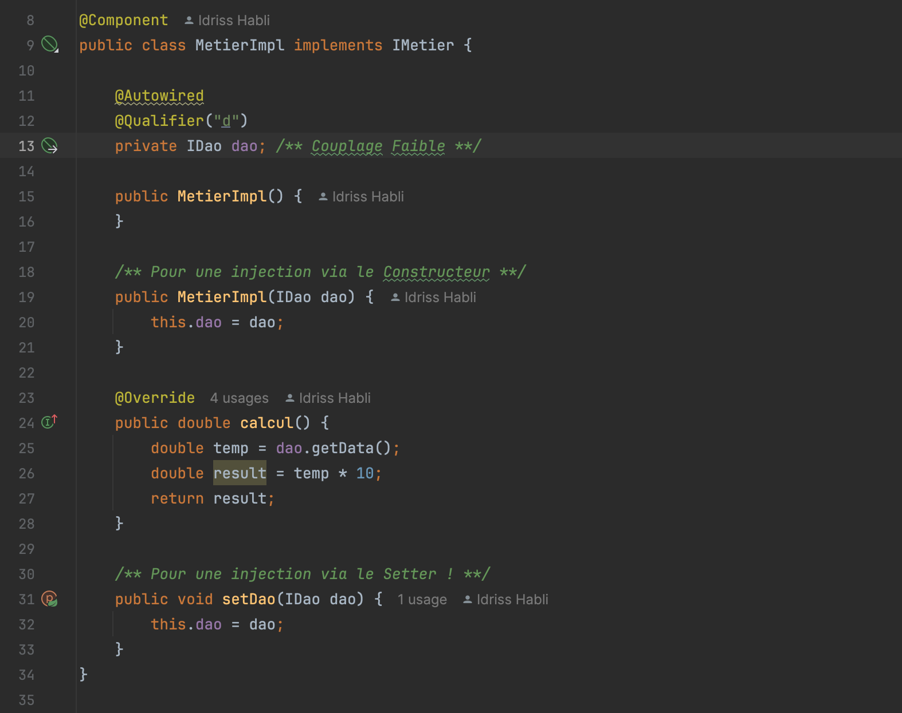
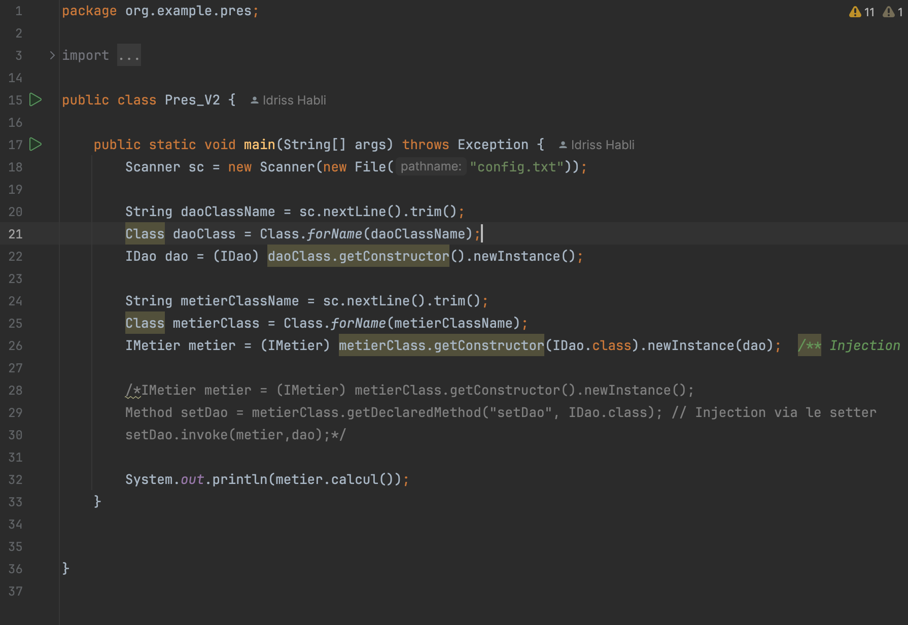
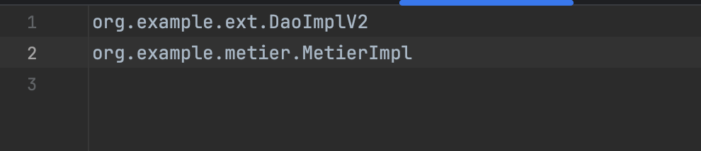
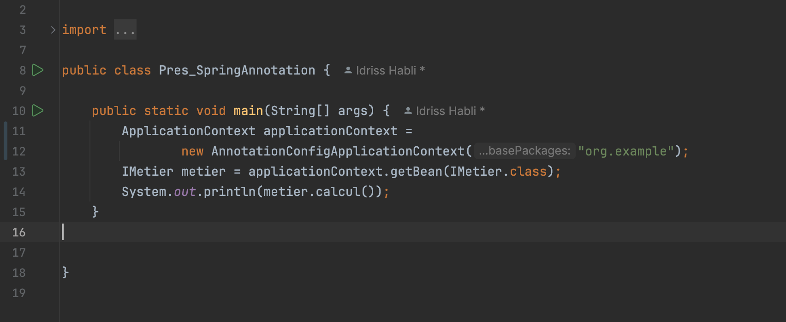

<h3>Injection des dépendances </h3>

<ol>
<li>

Création d'interface IDao avec une méthode getData

</li>

<li>

Création d'une implémentation de l'interface IDao

</li>

<li>

Création d'interface IMetier avec une méthode calcul

</li>

<li>

Création d'une implémentation de l'interface IMetier

</li>

<li>

L'injection des dépendances :

<ul>

<li>
<i>Par instanciation statique</i>

</li>

<li>
<i>Par instanciation dynamique</i>

 

</li>

<li>
<i>En utilisant le Framework Spring (Version XML)</i>

 

</li>

<li>
<i>En utilisant le Framework Spring (Version annotations)</i>

</li>

</ul>

</li>

</ol>
